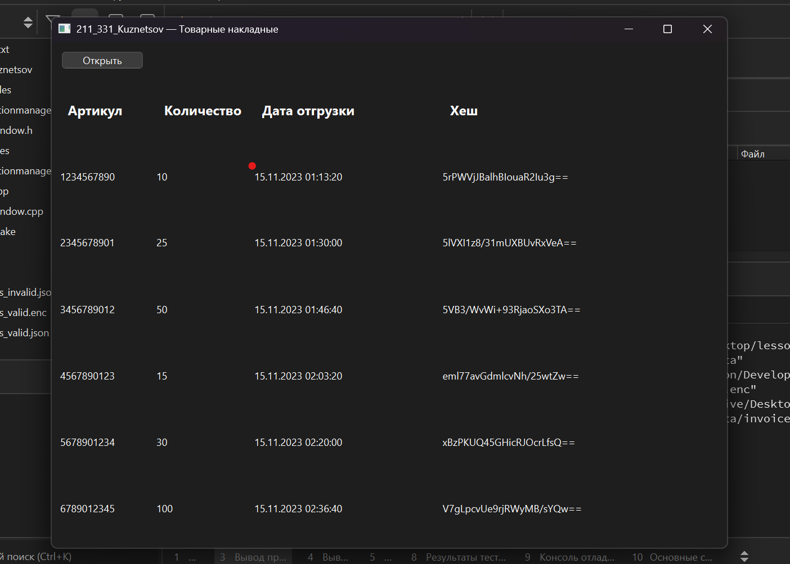
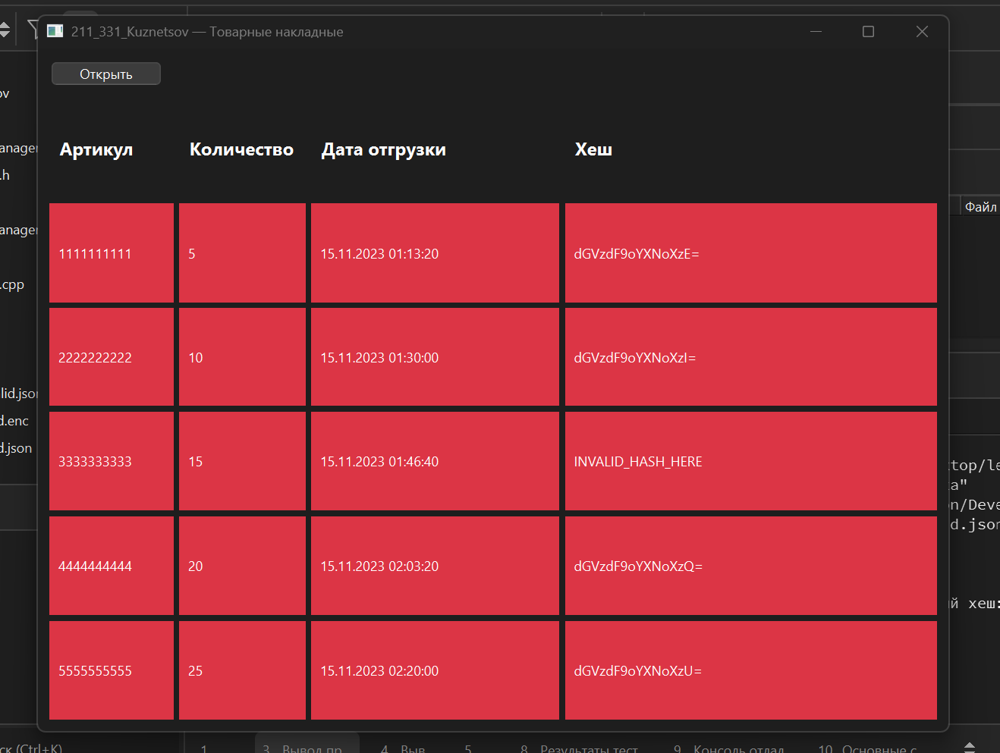

# Приложение для хранения и контроля целостности товарных накладных

Данное приложение разработано для хранения, контроля целостности и защиты массива записей товарных накладных. Приложение обеспечивает безопасное хранение данных с использованием шифрования AES-256-CBC, проверку целостности записей через цепочку MD5 хешей по формуле hash_i = MD5(article + quantity + timestamp + hash_i-1) и удобный графический интерфейс с использованием QGridLayout для табличного отображения данных. Приложение автоматически загружает данные из JSON файла при старте, поддерживает загрузку обычных JSON файлов и зашифрованных файлов с расширением .enc, которые автоматически расшифровываются перед обработкой. При обнаружении нарушений целостности данных невалидные записи и все последующие выделяются красным цветом для визуального выделения.

